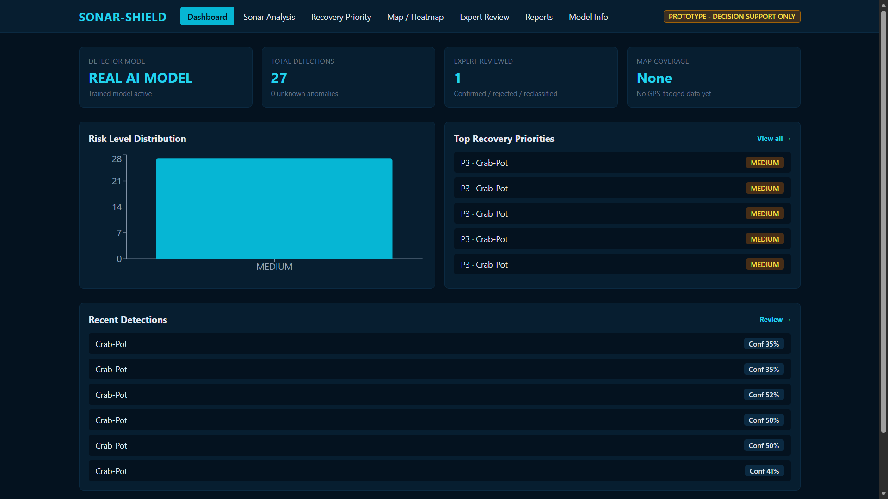
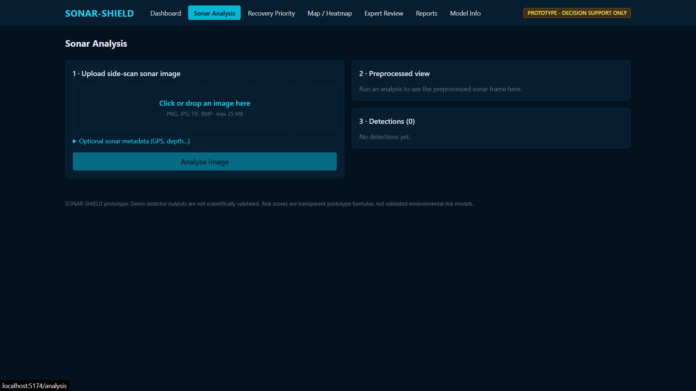
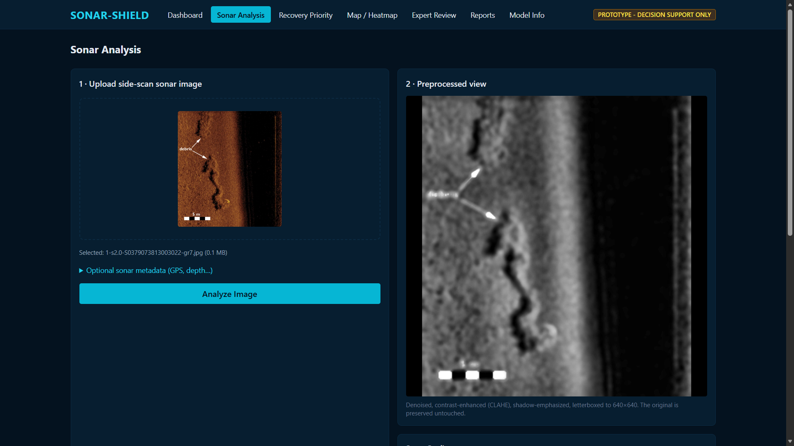
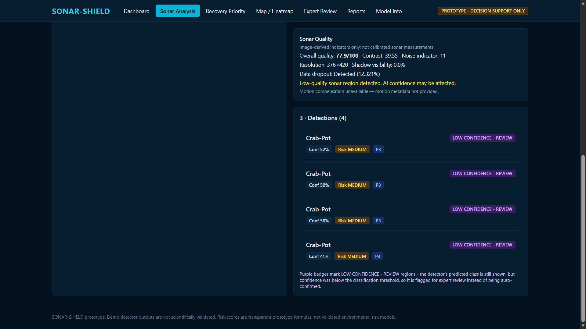
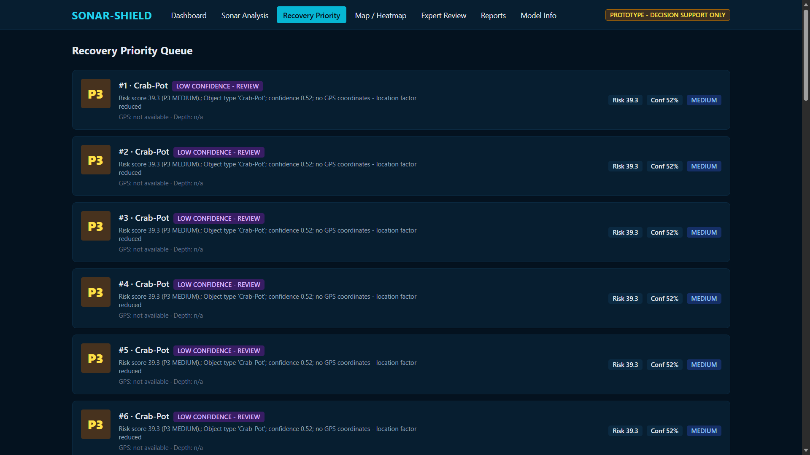
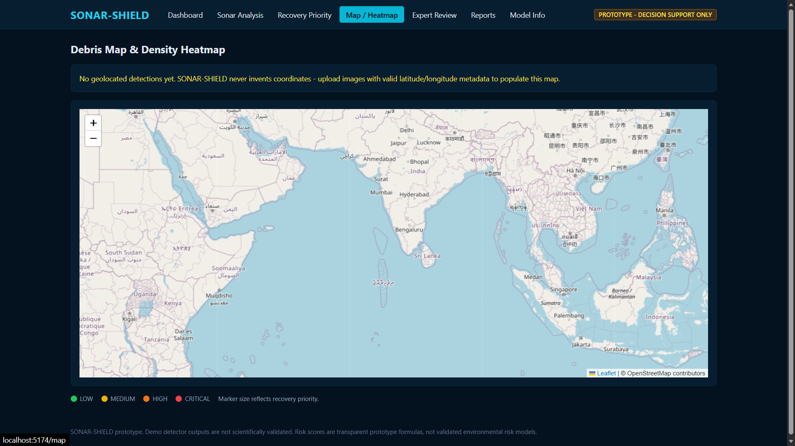
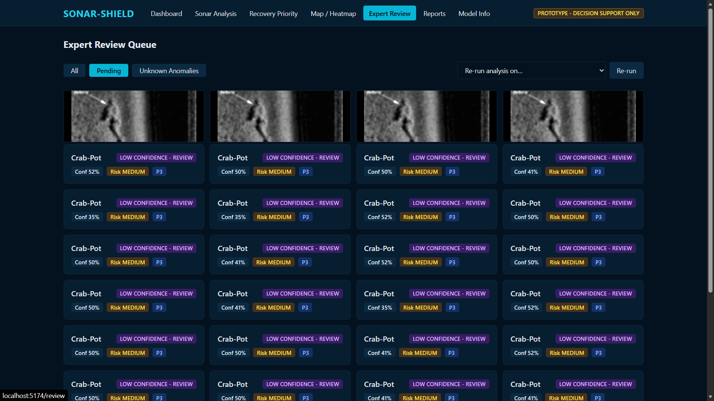
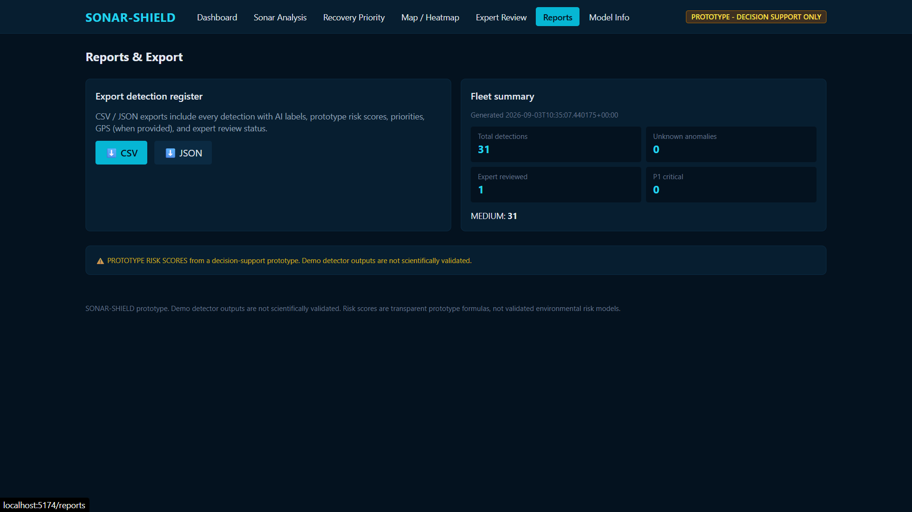
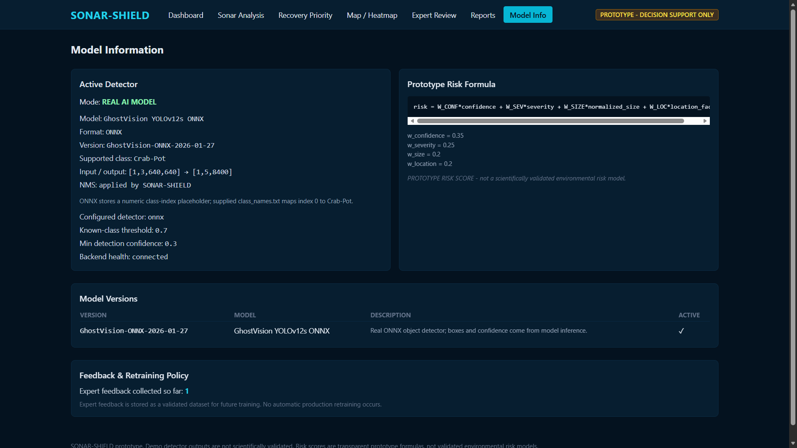

# SONAR-SHIELD

AI-assisted side-scan sonar analysis prototype. Takes a sonar image, runs it through a preprocessing pipeline, feeds it to a detector, and turns the raw prediction into something a human can actually review — confidence, evidence, a risk score, a priority level, and (if GPS data exists) a location on a map.

This is a prototype/decision-support tool, not a validated marine-survey system. See the Limitations and Disclaimer sections before assuming anything here is production-ready.

## Screenshots

### Dashboard



### Sonar Analysis



### Sonar Analysis - Upload Interface



### Sonar Analysis - Detection Results



### Recovery Priority



### Map & Heatmap



### Expert Review



### Reports & Export



### Model Information



## What it does

Side-scan sonar surveys produce a lot of images, and going through them one by one is slow. SONAR-SHIELD doesn't just run a detector and spit out a bounding box — it wraps the prediction in some context:

- What did the model detect, and how confident was it?
- If confidence is low, don't force it into a known class — flag it as unknown instead.
- What evidence actually backs up the detection, and what's just not available?
- Given confidence, severity, size, and location, what's a reasonable priority for someone to go check this out?
- Where is it, if GPS metadata was attached?
- Can a person confirm, reject, or reclassify the prediction, and is that review kept separate from the original AI output?

None of this is meant to replace a domain expert — it's meant to make their job of triaging detections faster.

## How it works

1. A sonar image (plus optional GPS/depth metadata) is uploaded.
2. The image goes through the preprocessing pipeline (denoising, contrast enhancement, letterboxing to model input size).
3. The processed image is passed to whatever detector is configured (ONNX by default).
4. The prediction's confidence is checked against a threshold — below it, the detection is marked as an unknown anomaly instead of a known class.
5. An evidence card is generated summarizing what's known and explicitly flagging what isn't.
6. A prototype risk score (0–100) is calculated from confidence, severity, size, and location.
7. The detection gets a recovery priority (P1–P4) based on that score.
8. Everything is saved to SQLite and served through the FastAPI backend.
9. The React frontend shows it on a dashboard, with map/heatmap views if GPS data exists.
10. A reviewer can confirm, reject, or reclassify the detection — this is stored alongside, not instead of, the original AI result.

## Architecture

```
Sonar Image + Metadata
        │
        ▼
  Preprocessing (OpenCV/NumPy)
        │
        ▼
   AI Detection (ONNX / PyTorch / Demo)
        │
        ▼
  Confidence Handling (known class vs. unknown anomaly)
        │
        ▼
   Evidence Engine
        │
        ▼
   Risk Engine (0-100)
        │
        ▼
   Priority Engine (P1-P4)
        │
        ▼
   SQLite (SQLAlchemy)
        │
        ▼
   FastAPI
        │
        ▼
   React Frontend ── Map / Heatmap / Reports
        │
        ▼
   Expert Review → Feedback Storage
```

## Main features

**AI / detection**
- Detector abstraction (`BaseDetector`) with ONNX, PyTorch adapter, and a deterministic demo detector for UI testing
- Confidence thresholding with unknown-anomaly fallback

**Preprocessing**
- Grayscale conversion, median + bilateral filtering, normalization, CLAHE, shadow enhancement, letterboxing to 640×640

**Decision support**
- Evidence cards that explicitly mark unavailable info instead of guessing
- Configurable prototype risk score
- P1–P4 recovery priority

**Visualization**
- Dashboard, detection details, interactive map (Leaflet), heatmap, charts (Recharts)

**Review**
- Confirm / reject / reclassify, with the original AI prediction preserved regardless of the review outcome

**Reporting**
- CSV and JSON export

## AI model

The currently integrated model is **GhostVision ONNX**, run through ONNX Runtime. The supplied class mapping (`class_names.txt`) only contains one class:

```
Crab-Pot
```

So right now this is a single-class crab-pot detector — not a general marine-debris detector. It doesn't identify fishing nets, cables, containers, wrecks, or anything else, even though the architecture is built to support more classes later.

Inference pipeline:

```
Preprocessed Image → 640×640 input ([1, 3, 640, 640]) → ONNX Runtime
→ raw output → NMS → confidence check → coordinate mapping → detection result
```

Confidence handling uses a threshold (`KNOWN_CLASS_THRESHOLD`, default `0.70`):

```
confidence ≥ 0.70 → known class
confidence <  0.70 → UNKNOWN ANOMALY
```

This keeps low-confidence guesses from being presented as if the model were sure about them.

No accuracy, precision, recall, or mAP numbers are reported here, because the model hasn't been evaluated on a proper labeled dataset yet.

## Evidence

The evidence engine's job is to not make things up. If a property can't be determined from the current analysis, it's shown as:

```
Not available from current analysis
```

instead of being silently filled in or guessed.

## Risk and priority

The risk score is a simple weighted heuristic, not a validated environmental risk model:

| Factor     | Weight |
|------------|-------:|
| Confidence | 0.35   |
| Severity   | 0.25   |
| Size       | 0.20   |
| Location   | 0.20   |

It outputs a score from 0–100, which feeds into a P1–P4 priority bucket. Both the weights and the priority mapping are meant to be tunable — they're not tuned against real-world outcomes right now, so treat them as a starting point rather than a ground-truth ranking.

## Expert review

Reviewers can confirm, reject, or reclassify a detection. The review is stored as a separate record from the original AI prediction, so you always have both the original model output and what a human decided about it. This is stored but not currently used for automatic retraining — it's there as a foundation for building a labeled dataset later.

## Technology stack

**Frontend**
- React, Vite, Tailwind CSS, React Router, Axios, Leaflet, Recharts

**Backend**
- Python, FastAPI, SQLAlchemy, Pydantic, SQLite

**AI / CV**
- ONNX Runtime, OpenCV, NumPy, PyTorch (adapter)

**Infra**
- Docker, Docker Compose, Git

**Testing**
- Pytest, FastAPI TestClient

## Project structure

```
sonar-shield/
│
├── backend/
│   ├── app/
│   │   ├── ai/
│   │   ├── api/
│   │   ├── evidence/
│   │   ├── models/
│   │   ├── preprocessing/
│   │   ├── priority/
│   │   ├── quality/
│   │   ├── risk/
│   │   ├── schemas/
│   │   ├── services/
│   │   └── utils/
│   ├── tests/
│   ├── Dockerfile
│   ├── requirements.txt
│   └── pytest.ini
│
├── frontend/
│   ├── src/
│   ├── Dockerfile
│   ├── package.json
│   ├── package-lock.json
│   └── vite.config.js
│
├── models/
│   ├── weights.onnx
│   ├── class_names.txt
│   └── README.md
│
├── data/
│
├── docker-compose.yml
└── .gitignore
```

## Setup

Requirements: Python 3.x, Node.js, npm, Git, and Docker if you want the containerized route.

### Backend

```bash
cd backend
python -m venv venv
```

Activate it:

```bash
# Windows
.\venv\Scripts\activate

# Linux / macOS
source venv/bin/activate
```

Install and run:

```bash
python -m pip install -r requirements.txt
uvicorn app.main:app --reload --port 8000
```

Backend runs at `http://localhost:8000`, API docs at `http://localhost:8000/docs`.

### Frontend

In a separate terminal:

```bash
cd frontend
npm install
npm run dev
```

Frontend runs at `http://localhost:5173`.

## Docker

```bash
docker compose up --build
```

This builds and starts both the backend and frontend containers. Endpoints are the same as running locally: frontend on `5173`, backend on `8000`, docs on `8000/docs`. This has been tested locally, not in any production environment.

## Testing

```bash
cd backend
pytest
```

If you're on Windows and hitting temp-directory permission issues:

```bash
pytest --basetemp .pytest_temp
```

Current result on the dev machine: **46 passed, 2 warnings**. The warnings are dependency deprecation notices, not failures. This confirms the backend logic works as expected in the current test suite — it says nothing about the AI model's real-world accuracy, since that hasn't been evaluated on a labeled dataset.

## Limitations

- **Model**: single-class (Crab-Pot) detector, not a multi-class marine-debris system.
- **Dataset**: no large, diverse, annotated sonar dataset behind this yet.
- **Validation**: no precision/recall/F1/mAP numbers — those require a proper evaluation set that doesn't exist yet.
- **Risk score**: a configurable heuristic, not a scientifically validated risk measurement.
- **GPS**: if location metadata isn't provided, the system doesn't fabricate coordinates — no map/heatmap data for that detection.
- **Retraining**: expert feedback is stored but not automatically used to retrain the model.
- **Hardware**: no direct integration with sonar acquisition hardware or underwater vehicles.
- **Security**: no auth/RBAC yet — this is meant for local/dev use, not a public deployment.

## Future improvements

- Additional validated classes (nets, cables, containers, wreck fragments, etc.) once there's a proper dataset and evaluation behind them
- Actual model benchmarking (precision, recall, F1, mAP, confusion matrix) on held-out data
- Swapping SQLite for something like PostgreSQL for anything beyond local use
- Auth and role-based access
- Turning the feedback loop into an actual retraining pipeline
- Better geospatial tooling (survey-track visualization, spatial clustering, coverage analysis)

## Disclaimer

SONAR-SHIELD is a prototype built for research/demonstration purposes. The risk scores and priority levels it produces should not be used as the sole basis for real marine recovery, environmental, navigation, or safety decisions. Any real-world use would need a validated dataset, expert annotation, formal model evaluation, real sonar hardware integration, and field testing.
